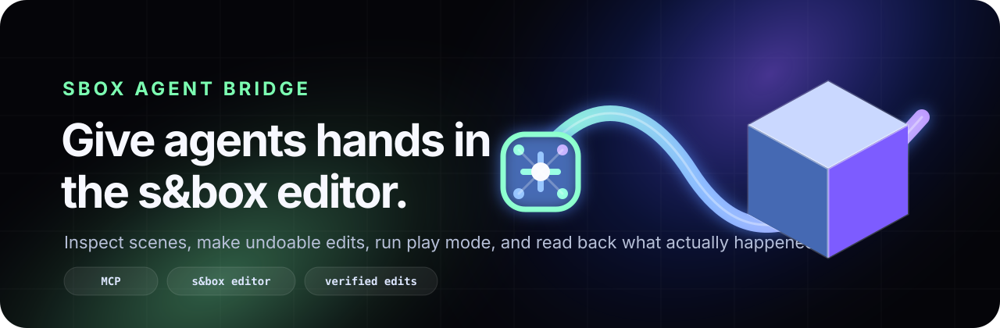

<p align="center">
  
</p>

<h1 align="center">sbox-agent-bridge</h1>

<p align="center">
  <strong>Let MCP-capable agents inspect, edit, test, and recover a live s&amp;box editor session.</strong>
</p>

<p align="center">
  <a href="https://github.com/user1303836/sbox-agent-bridge/actions/workflows/ci.yml"></a>
  <a href="LICENSE"></a>
  = 20">
  
  
</p>

---

`sbox-agent-bridge` is a provider-neutral **MCP server + s&box editor bridge**. It gives agents a safe, observable way to operate the editor: read live scene state, make undoable changes, assign assets, run play mode, inspect compile/log feedback, and verify results from the editor instead of guessing from files.

Think: **Claude/Codex/Kimi/etc. as a careful level-design and gameplay prototyping partner inside s&box** — with narrow tools, read-backs, and smoke tests instead of an unsafe arbitrary-code bridge.

## Why this is useful

A normal coding agent can edit C# files, but it cannot see what actually happened in the s&box editor. This bridge closes that loop.

| Without the bridge | With `sbox-agent-bridge` |
|---|---|
| Guess scene state from source files | Read the active editor scene or runtime `GameSession` |
| Write code and hope hotload worked | Wait for compile, read diagnostics, inspect logs |
| Manually place/check objects | Create, transform, parent, frame, and verify GameObjects |
| Guess asset paths and component shapes | Search assets and inspect property schemas before writing |
| Test gameplay by squinting at the viewport | Invoke deterministic runtime test actions and capture cameras |
| Recover stale play-mode sessions manually | Use `editor.recover_scene`, tab reads, and wait helpers |

## Quick start

> Requirements: s&box installed, Node.js 20+, npm, and an MCP-capable client.

### 1. Build the MCP server

```powershell
git clone https://github.com/user1303836/sbox-agent-bridge.git
cd sbox-agent-bridge\mcp-server
npm install
npm run build
```

### 2. Install the editor bridge into a project

For a fresh test project, create a Minimal Game project and install the bridge:

```powershell
cd C:\path\to\sbox-agent-bridge

.\scripts\create-minimal-sbox-project.ps1 `
  -ProjectPath 'C:\Users\you\Documents\s&box projects\AgentBridgeMvpFresh' `
  -Title 'Agent Bridge MVP Fresh' `
  -Ident 'agent_bridge_mvp_fresh'

.\scripts\install-editor-bridge.ps1 `
  -ProjectPath 'C:\Users\you\Documents\s&box projects\AgentBridgeMvpFresh'
```

Or install into an existing s&box project:

```powershell
.\scripts\install-editor-bridge.ps1 `
  -ProjectPath 'C:\Users\you\Documents\s&box projects\YourProject'
```

Open the project in s&box and wait for compile. The bridge starts automatically after the editor library loads. A status dock appears under:

```text
View -> Agent Bridge
```

### 3. Configure your MCP client

Point your client at the built server:

```json
{
  "mcpServers": {
    "sbox-agent-bridge": {
      "command": "node",
      "args": ["C:/absolute/path/to/sbox-agent-bridge/mcp-server/dist/index.js"]
    }
  }
}
```

For isolated fresh-project or multi-editor runs, set the same IPC root for both the launched editor and MCP server:

```json
{
  "mcpServers": {
    "sbox-agent-bridge": {
      "command": "node",
      "args": ["C:/absolute/path/to/sbox-agent-bridge/mcp-server/dist/index.js"],
      "env": {
        "SBOX_AGENT_BRIDGE_IPC": "C:/temp/sbox-agent-bridge-mvp-fresh"
      }
    }
  }
}
```

Launch a project with that IPC root:

```powershell
$env:SBOX_AGENT_BRIDGE_IPC = "$env:TEMP\sbox-agent-bridge-mvp-fresh"
.\scripts\start-sbox-project.ps1 `
  -ProjectFile 'C:\Users\you\Documents\s&box projects\AgentBridgeMvpFresh\agent_bridge_mvp_fresh.sbproj' `
  -IpcRoot $env:SBOX_AGENT_BRIDGE_IPC `
  -ClearIpc `
  -WaitForBridgeSeconds 90
```

### 4. Ask for the first read-only check

```text
Use the sbox-agent-bridge MCP tools to run the bridge doctor, list editor tabs, summarize the active scene, and inspect the current selection. Do not mutate the scene yet.
```

Then try one tiny edit:

```text
Create one GameObject named Agent Bridge Test, verify that it exists, then undo the creation.
```

## What agents can do today

| Area | Examples |
|---|---|
| **Editor health** | `bridge.doctor`, project info, tab/session reads, stale play-tab warnings |
| **Scene operations** | summarize hierarchy, search, inspect details, create/save/recover scenes |
| **GameObjects** | create, rename, transform, enable/disable, duplicate, reparent, frame, destroy with cleanup fallbacks |
| **Components** | list, inspect schemas, add/remove, enable/disable, dry-run validate, set properties |
| **Assets/materials** | search assets, inspect models/materials, create/edit `.vmat`, assign models/materials, preview models |
| **Prefabs** | create, list, inspect, instantiate with GUID remapping, inspect instance patch metadata |
| **Physics** | add/read rigidbodies, colliders, joints; run raycasts |
| **Sound** | create `.sound` events, assign/read `SoundPointComponent`, preview playback |
| **Visual feedback** | capture camera PNGs with luminance stats; preview isolated model/material combinations |
| **Play/debug loop** | start/stop play mode, wait for runtime, read compile status/logs, run deterministic runtime test hooks |
| **Scripts** | create/edit/delete C# files and wait for compile recovery |
| **Smoke tests** | run focused live-editor smokes and a clean-room boxing gameplay walkthrough |

The current MCP tools are: `editor`, `scene`, `gameobject`, `component`, `script`, `asset`, `visual`, `sound`, `physics`, `prefab`, and `runtime`.

For exact action payloads, see [docs/protocol.md](docs/protocol.md). For the verified capability matrix, see [docs/capability-matrix.md](docs/capability-matrix.md).

## A compelling workflow

Once the bridge is installed, an agent can perform a full editor loop:

1. Run `bridge.doctor` and read the active project/scene.
2. Create or recover a saved scene.
3. Add GameObjects, components, models, materials, physics, sound, and prefabs.
4. Validate component values before mutating them.
5. Save the scene and enter play mode.
6. Wait for runtime readiness and inspect the live `GameSession`.
7. Run deterministic runtime test actions.
8. Capture camera output and inspect compile/log feedback.
9. Stop play mode and recover the editable scene.

That loop is what makes the bridge different from a file-only coding assistant: the agent can **observe the editor, act, and verify**.

## Smoke tests

CI validates the TypeScript MCP server and metadata. Live editor behavior requires s&box to be open.

```powershell
cd mcp-server
npm run ci                # typecheck, unit tests, build
npm run smoke:mvp-suite   # preferred external-tester live gate
```

The MVP suite creates its own saved scene and verifies the main bridge path: doctor, compile wait, scene recovery, object creation, model/material assignment, physics/sound/prefab read-back, runtime preview capture, script delete/compile recovery, animation helper setup, particle setup, play/stop settle, and cleanup.

Other focused smokes:

```powershell
npm run smoke:bootstrap
npm run smoke:assets
npm run smoke:physics
npm run smoke:prefabs
npm run smoke:sounds
npm run smoke:capability-gaps
npm run smoke:runtime
npm run walkthrough:boxing
```

See [docs/testing.md](docs/testing.md) for all live-smoke commands and environment variables.

## Current caveats

This is useful now, but still intentionally honest:

- The editor bridge must be installed into each s&box project that should expose live access.
- CI cannot currently run a real s&box editor, so editor behavior is verified by local smoke tests.
- Local project component discovery is partial; exact-name `component.add` works for compiled local components in verified cases.
- `gameobject.duplicate` is shallow: name/enabled/transform/parent, not full child/component cloning.
- `visual.capture_camera` captures camera output, not the full editor/game viewport overlay or generic UI panel hierarchy.
- Semantic model orientation still needs stored overrides or human/vision confirmation; bounds alone cannot prove “upright.”
- There is no in-editor project switch action yet; use `scripts/start-sbox-project.ps1` or open the `.sbproj` manually.

See [docs/status.md](docs/status.md) for current verification status and limitations.

## Repository map

```text
editor/       s&box editor library: dock, frame pump, dispatcher, handlers
mcp-server/   TypeScript MCP stdio server, bridge client, tools, tests
scripts/      project creation/install/launch helpers for tester workflows
schemas/      bridge command/response JSON schemas
docs/         status, protocol, testing, architecture, capability matrix
assets/       README/logo assets
```

Start with:

- [Tester Quickstart](docs/tester-quickstart.md) — shortest validation path
- [Docs Index](docs/README.md) — map of the detailed docs
- [Status](docs/status.md) — verified state and caveats
- [Capability Matrix](docs/capability-matrix.md) — per-feature coverage
- [Protocol](docs/protocol.md) — action names and payload notes
- [Architecture](docs/architecture.md) — bridge design

## Design principles

- **Live state first**: inspect the editor before mutating it.
- **Small, named actions**: no broad arbitrary-code bridge.
- **Undoable when possible**: scene edits use editor undo scopes.
- **Verified read-back**: mutations return what the editor actually sees after the change.
- **Provider-neutral**: works with any MCP-capable agent.
- **s&box-grounded**: no Unity/Godot/GMod API guessing.

## License

MIT. See [LICENSE](LICENSE).
